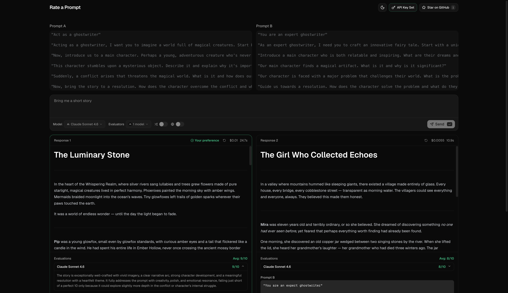

# Rate a Prompt

Compare two system prompts side-by-side and see which one is actually better — judged by your own eyes and by AI evaluators.

**[Try it live → rateaprompt.dibenko.com](https://rateaprompt.dibenko.com)** — no install, no sign-up.

Free and open-source. Bring your own [OpenRouter](https://openrouter.ai) key and you only pay for the tokens you use.



## Why

Writing a good system prompt is guesswork. You tweak it, run it, and *feel* like it got better — but there's no easy way to put prompt A next to prompt B and really compare.

Rate a Prompt runs both prompts against the same question, streams the answers side-by-side, and helps you pick the winner.

## What you can do

- **Compare side-by-side** — two prompts, one question, both answers streamed in parallel.
- **Judge blind** — pick the better answer before you see which prompt wrote it.
- **Shuffle sides** — so you don't just favor "the one on the left."
- **Auto-score** — let up to 5 AI models rate each answer 0–10 with a one-line reason.
- **Any model** — choose from the list or paste any OpenRouter model ID.
- **Web search** — optionally let the model search the web while answering.
- **See the cost** — know what each comparison cost you.

## How it works

1. Write **Prompt A** and **Prompt B**.
2. Ask one question and pick a model to run both prompts.
3. *(Optional)* Add AI evaluators and turn on shuffle.
4. Hit **Send** — both answers stream in side-by-side.
5. Click **I prefer this one** on the better answer.
6. See which prompt won, plus the evaluator scores.

## Run it locally

Most people can just use the [hosted app](https://rateaprompt.dibenko.com). To run your own copy you'll need [Bun](https://bun.sh) ≥ 1.3 and an [OpenRouter API key](https://openrouter.ai/keys):

```bash
bun install
bun run dev
```

Open [http://localhost:3000](http://localhost:3000), click **Set API Key**, and paste your OpenRouter key.

| Command | What it does |
| --- | --- |
| `bun run dev` | Start the dev server |
| `bun run build` | Production build |
| `bun run start` | Run the production build |
| `bun run lint` | Lint & format with Biome |
| `bun run typecheck` | Type-check with TypeScript |

## Privacy

Your API key stays in your browser's `localStorage` and is sent straight to OpenRouter with each request. No server ever stores it. No database, no accounts, no billing — the app keeps nothing.

## Tech stack

Next.js (App Router) · TypeScript · Bun · tRPC v11 (streaming) · Tailwind CSS v4 · shadcn/ui · Zod · Biome

## Contributing

Issues and PRs welcome. Before opening a PR, run:

```bash
bun run lint
bun run build
```

## License

[MIT](LICENSE)
